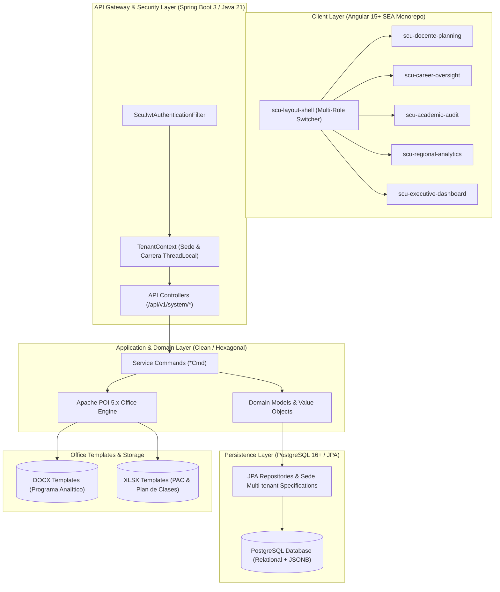
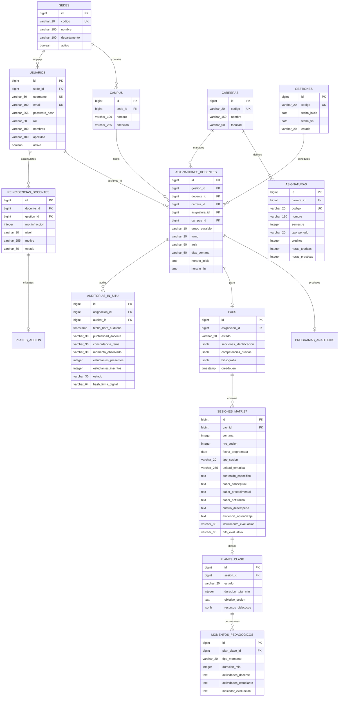
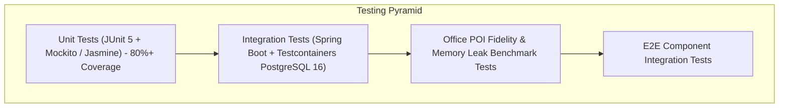

# SISA • Technical Design: 01-sisa-system-foundation
**Sistema Integrado de Seguimiento Académico — UNITEPC**

**Document Version**: 1.0.0  
**Change Target**: `01-sisa-system-foundation`  
**Status**: APPROVED DESIGN BASELINE  
**Conventions Reference**: SEA Coding Standards (`.atl/conventions-frontend.md`, `.atl/conventions-backend.md`, `DESIGN.md`)

---

## 1. Executive Summary & Architecture Overview

The `01-sisa-system-foundation` change defines the complete end-to-end technical blueprint for the Sistema Integrado de Seguimiento Académico (SISA) of Universidad Técnica Privada Cosmos (UNITEPC). SISA modernizes and unifies the academic planning trilogy, real-time in situ classroom auditing, disciplinary recurrence escalation, and high-fidelity institutional document generation across all 4 national regional branches: **Cochabamba**, **La Paz**, **El Alto**, and **Cobija**.



---

## 2. Architectural Decision Records (ADRs)

### ADR-01: Clean / Hexagonal Architecture with Command Pattern (Backend)
- **Context**: SISA requires strict separation of business rules, domain invariants (e.g. 20-week PAC validation, 3-moment classroom duration sum), security scoping, and document generation.
- **Decision**: Structure backend code under `bo.edu.unitepc.sisa` strictly following Clean/Hexagonal principles:
  - `api`: REST controllers, DTO requests/responses, OpenAPI specs.
  - `service.command`: Encapsulated single-purpose command handlers (`*Cmd`).
  - `domain.model`: Pure JPA domain entities, enums, and domain logic.
  - `domain.repository`: Repository interfaces.
  - `infrastructure.persistence`: Spring Data JPA implementations, multi-tenant specifications, and custom JSONB type converters.
  - `infrastructure.security`: Spring Security 6 filter chain, JWT decoder, `TenantContext`.
  - `infrastructure.office`: Apache POI template cloners, parsers, and dynamic row shifters.
- **Consequences**: High testability, zero business logic leakage into controllers, clear traceability with SEA backend conventions.

### ADR-02: PostgreSQL Relational Schema with JSONB Hybrid Payloads
- **Context**: Macro-entities (Sedes, Carreras, Gestiones, Asignaciones, PACs, Auditorías) require strict ACID relational integrity. However, microdidactic session plans, rubrics, and dynamic pedagogical moments vary in structure between medical sciences, engineering, and humanities.
- **Decision**: Use a relational PostgreSQL 16+ schema for primary academic and governance relationships, combined with `JSONB` columns for variable didactical payloads (`saberes`, `criterios_evaluacion`, `recursos_didacticos`, `momentos_pedagogicos`).
- **Consequences**: Fast relational joins and foreign key constraints for institutional hierarchy, with schema flexibility and fast indexable GIN search on didactical structures.

### ADR-03: Multi-tenant Regional Isolation via Sede Context Filter & ThreadLocal
- **Context**: UNITEPC operates across 4 regional branches (`Cochabamba`, `La Paz`, `El Alto`, `Cobija`). Regional Directors and Vice-Rectors must only access data within their assigned branch, while the National Vice-Rector has cross-branch visibility.
- **Decision**: Implement `TenantContext` backed by `ThreadLocal<TenantInfo>` populated by `ScuJwtAuthenticationFilter`. All JPA queries for tenant-scoped entities apply automatic Sede filtering via Spring Data JPA Specifications and `@PreAuthorize` authorization rules.
- **Consequences**: Strict isolation prevents cross-sede data leaks (Scenario 1.3 in Spec). Clean teardown in filter `finally` blocks prevents ThreadLocal leaks.

### ADR-04: Stateless JWT Authentication & 5-Tier RBAC
- **Context**: SISA must support 5 distinct user roles with differentiated capabilities across desktop views.
- **Decision**: Stateless JWT with HMAC-SHA512/RSA-256 signature containing claims: `userId`, `username`, `email`, `role`, `sedeId`, and `carreraIds`. The 5 roles are:
  1. `ROLE_DOCENTE`
  2. `ROLE_DIR_CARRERA`
  3. `ROLE_DIR_ACADEMICA`
  4. `ROLE_VICERRECTOR_SEDE`
  5. `ROLE_VICERRECTOR_NACIONAL`
- **Consequences**: Horizontally scalable, zero session state on server, fine-grained access control on every endpoint.

### ADR-05: Apache POI Dynamic Row Shifting & Cloner Pattern for Official Office Documents
- **Context**: Institutional documents (Word Programa Analítico, Excel PAC Matriz 7, Excel Plan de Clases) have rigid university headers, logos, borders, font typography, and official signature blocks that cannot be altered or distorted by dynamic table rows.
- **Decision**: Implement `DocxTemplateCloner`, `XlsxTemplateCloner`, and `DynamicRowShifter`. Dynamic row injection in Excel uses `XSSFSheet.shiftRows(startRow, endRow, n, true, false)` with style/formula replication from a hidden prototype template row.
### ADR-07: 5-Moment Pedagogical Breakdown with Configurable Classroom Durations & Zero Fixed-Cardinality Assumption
- **Context**: Institutional Didactic Sequences require 5 distinct pedagogical moments (*1. Introducción*, *2. Resultados de Aprendizaje / Logros Esperados*, *3. Contenidos de la Clase*, *4. Cuerpo de Contenidos*, and *5. Conclusión o Cierre*). Different academic faculties and courses have varying credit hours, session totals, and empty optional fields (e.g. blank Tema fields in specific syllabi).
- **Decision**: Provide dynamic duration calculations per moment, validate that total minutes equal the course session target, and dynamically parse all workbook sheets (`wb.getNumberOfSheets()`) without forcing artificial fallbacks onto blank cells.
- **Consequences**: Exact fidelity to official university Excel formats and support for arbitrary subject structures.

### ADR-08: UNITEPC SEA Central Gateway Integration via OAuth2 M2M & Anti-Corruption Layer (ACL)
- **Context**: SISA must synchronize master academic records (Sedes, Carreras, Pensum Courses, Groups, Teachers, Campuses, Classrooms, Students, and Active TimeFrames) from UNITEPC's centralized API Gateway (`https://gw-dev.unitepc.solutions`).
- **Decision**: Implement `UnitepcGatewayClient` in Spring Boot 3.3 utilizing `RestClient` with thread-safe OAuth2 `client_credentials` JWT auto-renewal (300s TTL with 30s proactive renewal buffer). Expose internal proxy endpoints under `/api/v1/catalogo-academico/*` and mirror data into local PostgreSQL tables (`sea_sedes`, `sea_carreras`, `sea_materias`, `sea_grupos`) following the ACL and Cache-Aside patterns. Provide real-time `Live / Offline` connectivity indicators in the Angular UI via `UnitepcGatewayService`.
- **Consequences**: Total operational resilience with offline fallback capabilities, zero direct coupling of domain models to external schemas, and live synchronization of official university academic catalogs.

---

## 3. Backend Technical Architecture (Spring Boot 3+ / Java 21)

### 3.1 Package Hierarchy (`bo.edu.unitepc.sisa`)

```
bo.edu.unitepc.sisa/
├── SisaApplication.java
├── api/
│   ├── controller/
│   │   ├── ScuAuthController.java
│   │   ├── ScuAcademicController.java
│   │   ├── ScuPlanningController.java
│   │   ├── ScuAuditController.java
│   │   └── ScuOfficeController.java
│   ├── request/
│   │   ├── ScuLoginRequest.java
│   │   ├── ScuRefreshTokenRequest.java
│   │   ├── ScuAsignacionDocenteRequest.java
│   │   ├── ScuProgramaAnaliticoRequest.java
│   │   ├── ScuPacRequest.java
│   │   ├── ScuPacReviewRequest.java
│   │   ├── ScuPlanClaseRequest.java
│   │   ├── ScuAuditoriaInSituRequest.java
│   │   ├── ScuAuditoriaSignRequest.java
│   │   └── ScuPlanAccionRequest.java
│   └── response/
│       ├── ScuAuthResponse.java
│       ├── ScuAsignacionDocenteResponse.java
│       ├── ScuProgramaAnaliticoResponse.java
│       ├── ScuPacResponse.java
│       ├── ScuPlanClaseResponse.java
│       ├── ScuAuditoriaInSituResponse.java
│       ├── ScuReincidenciaResponse.java
│       └── ScuRegionalKpisResponse.java
├── builder/
│   ├── ResourceBuilder.java
│   └── ResourcesBuilder.java
├── domain/
│   ├── model/
│   │   ├── Sede.java
│   │   ├── Campus.java
│   │   ├── Carrera.java
│   │   ├── Asignatura.java
│   │   ├── Gestion.java
│   │   ├── Usuario.java
│   │   ├── AsignacionDocente.java
│   │   ├── ProgramaAnalitico.java
│   │   ├── UnidadAprendizaje.java
│   │   ├── Bibliografia.java
│   │   ├── Pac.java
│   │   ├── SesionMatriz7.java
│   │   ├── PlanDeClase.java
│   │   ├── MomentoPedagogico.java
│   │   ├── AuditoriaInSitu.java
│   │   ├── ReincidenciaDocente.java
│   │   └── PlanAccion.java
│   ├── enums/
│   │   ├── RolUsuario.java
│   │   ├── EstadoGestion.java
│   │   ├── TurnoClase.java
│   │   ├── TipoSesion.java
│   │   ├── TipoPeriodo.java
│   │   ├── InstrumentoEvaluacion.java
│   │   ├── HitoEvaluativo.java
│   │   ├── EstadoPlanificacion.java
│   │   ├── TipoMomentoPedagogico.java
│   │   ├── PuntualidadDocente.java
│   │   ├── ConcordanciaTema.java
│   │   ├── EstadoAuditoria.java
│   │   └── NivelReincidencia.java
│   └── repository/
│       ├── SedeRepository.java
│       ├── CampusRepository.java
│       ├── CarreraRepository.java
│       ├── AsignaturaRepository.java
│       ├── GestionRepository.java
│       ├── UsuarioRepository.java
│       ├── AsignacionDocenteRepository.java
│       ├── ProgramaAnaliticoRepository.java
│       ├── PacRepository.java
│       ├── PlanDeClaseRepository.java
│       ├── AuditoriaInSituRepository.java
│       ├── ReincidenciaDocenteRepository.java
│       └── PlanAccionRepository.java
├── service/
│   └── command/
│       ├── ScuAuthenticateUserCmd.java
│       ├── ScuRefreshTokenCmd.java
│       ├── ScuCreateAsignacionDocenteCmd.java
│       ├── ScuListAsignacionesDocentesCmd.java
│       ├── ScuSaveProgramaAnaliticoCmd.java
│       ├── ScuSavePacCmd.java
│       ├── ScuReviewPacCmd.java
│       ├── ScuSavePlanClaseCmd.java
│       ├── ScuInitiateAuditoriaInSituCmd.java
│       ├── ScuFinalizeAuditoriaInSituCmd.java
│       ├── ScuSignAuditoriaInSituCmd.java
│       ├── ScuListReincidenciasCmd.java
│       ├── ScuExportPacXlsxCmd.java
│       └── ScuExportProgramaDocxCmd.java
├── infrastructure/
│   ├── persistence/
│   │   ├── specification/
│   │   │   └── SedeTenantSpecification.java
│   │   └── converter/
│   │       ├── JsonbMomentoListConverter.java
│   │       └── JsonbStringListConverter.java
│   ├── security/
│   │   ├── SecurityConfig.java
│   │   ├── ScuJwtAuthenticationFilter.java
│   │   ├── JwtTokenProvider.java
│   │   ├── TenantContext.java
│   │   ├── TenantInfo.java
│   │   └── ScuUserDetailsService.java
│   └── office/
│       ├── DocxTemplateCloner.java
│       ├── XlsxTemplateCloner.java
│       ├── DynamicRowShifter.java
│       ├── PacExcelParser.java
│       ├── PlanesClaseExcelParser.java
│       ├── ProgramaAnaliticoDocxParser.java
│       └── OfficeTemplateService.java
└── exception/
    ├── ScuException.java
    ├── ScuAuthException.java
    ├── ScuForbiddenSedeAccessException.java
    ├── ScuScheduleOverlapException.java
    ├── ScuGestionClosedException.java
    ├── ScuPlanDurationMismatchException.java
    ├── ScuOfficeTemplateNotFoundException.java
    └── GlobalExceptionHandler.java
```

---

### 3.2 Security & Multi-Tenancy Design

```mermaid
sequenceDiagram
    autonumber
    actor Client as Angular Client
    participant JWT as ScuJwtAuthenticationFilter
    participant Ctx as TenantContext (ThreadLocal)
    participant Sec as Spring SecurityFilterChain
    participant Ctrl as ScuPlanningController
    participant Cmd as ScuSavePacCmd
    participant Repo as PacRepository (Specification)
    participant DB as PostgreSQL 16+

    Client->>JWT: HTTP Request + Bearer JWT Token
    JWT->>JWT: Validate HMAC/RSA Signature & Expiry
    JWT->>JWT: Extract userId, role, sedeId, carreraIds
    JWT->>Ctx: setTenantInfo(TenantInfo(sedeId, carreraIds))
    JWT->>Sec: Set Authentication in SecurityContext
    Sec->>Ctrl: Dispatch to @PreAuthorize endpoint
    Ctrl->>Cmd: execute(ScuPacRequest)
    Cmd->>Cmd: Invariant validations (20 wks, 36 sessions)
    Cmd->>Repo: save(pacEntity) with SedeTenantSpecification
    Repo->>DB: INSERT / UPDATE (scoped by sede_id)
    DB-->>Repo: Saved entity
    Repo-->>Cmd: Pac entity
    Cmd-->>Ctrl: ScuPacResponse via ResourceBuilder
    Ctrl-->>Client: HTTP 201 Created (JSON)
    Note over JWT,Ctx: finally { TenantContext.clear(); }
```

#### Multi-Tenant Context Holder (`TenantContext.java`)
```java
package bo.edu.unitepc.sisa.infrastructure.security;

/**
 * ThreadLocal holder for multi-tenant regional execution context.
 *
 * @author GentleAI SISA Architecture Team
 */
public final class TenantContext {

    private static final ThreadLocal<TenantInfo> CURRENT_TENANT = new ThreadLocal<>();

    private TenantContext() {
        // Prevent instantiation
    }

    public static void setTenantInfo(TenantInfo tenantInfo) {
        CURRENT_TENANT.set(tenantInfo);
    }

    public static TenantInfo getTenantInfo() {
        return CURRENT_TENANT.get();
    }

    public static Long getCurrentSedeId() {
        TenantInfo info = CURRENT_TENANT.get();
        return (info != null) ? info.getSedeId() : null;
    }

    public static void clear() {
        CURRENT_TENANT.remove();
    }
}
```

---

### 3.3 Apache POI Office Engine Design

```mermaid
classDiagram
    class OfficeTemplateService {
        -Map<String, byte[]> templateCache
        +loadTemplate(String templatePath) InputStream
        +exportPacXlsx(Pac pac) byte[]
        +exportPlanClasesXlsx(PlanDeClase plan) byte[]
        +exportProgramaDocx(ProgramaAnalitico programa) byte[]
    }

    class DocxTemplateCloner {
        -XWPFDocument document
        +open(InputStream templateStream)
        +replacePlaceholders(Map<String, String> values)
        +injectTableRow(XWPFTable table, int prototypeRowIdx, List<String> cellValues)
        +writeToStream(OutputStream outputStream)
    }

    class XlsxTemplateCloner {
        -XSSFWorkbook workbook
        +open(InputStream templateStream)
        +getSheet(String sheetName) XSSFSheet
        +writeToStream(OutputStream outputStream)
    }

    class DynamicRowShifter {
        +shiftAndCloneRows(XSSFSheet sheet, int startRow, int numRowsToInsert, int prototypeRowIdx)
        +cloneCellStyle(XSSFCell source, XSSFCell target)
        +updateFormulaReferences(XSSFSheet sheet, int shiftedBy)
    }

    class PacExcelParser {
        +parsePac(InputStream excelStream) PacDto
        -extractMatriz7(XSSFSheet sheet) List~SesionCronogramaDto~
    }

    class PlanesClaseExcelParser {
        +parsePlanes(InputStream excelStream) List~PlanDeClaseDto~
        -validateMomentoSum(PlanDeClaseDto plan) boolean
    }

    OfficeTemplateService --> DocxTemplateCloner
    OfficeTemplateService --> XlsxTemplateCloner
    OfficeTemplateService --> DynamicRowShifter
    OfficeTemplateService --> PacExcelParser
    OfficeTemplateService --> PlanesClaseExcelParser
```



#### Dynamic Row Shifter Implementation Logic (`DynamicRowShifter.java`)
```java
package bo.edu.unitepc.sisa.infrastructure.office;

import org.apache.poi.ss.usermodel.*;
import org.apache.poi.xssf.usermodel.XSSFCell;
import org.apache.poi.xssf.usermodel.XSSFRow;
import org.apache.poi.xssf.usermodel.XSSFSheet;

/**
 * Dynamic row expansion engine for Excel templates, preserving styles, borders, and formulas.
 *
 * @author GentleAI SISA Architecture Team
 */
public class DynamicRowShifter {

    public static void shiftAndCloneRows(XSSFSheet sheet, int startRow, int numRowsToInsert, int prototypeRowIdx) {
        if (numRowsToInsert <= 0) {
            return;
        }

        int lastRowNum = sheet.getLastRowNum();
        sheet.shiftRows(startRow, lastRowNum, numRowsToInsert, true, false);

        XSSFRow prototypeRow = sheet.getRow(prototypeRowIdx);
        if (prototypeRow == null) {
            throw new IllegalStateException("Prototype row not found at index: " + prototypeRowIdx);
        }

        for (int i = 0; i < numRowsToInsert; i++) {
            int newRowIdx = startRow + i;
            XSSFRow newRow = sheet.createRow(newRowIdx);
            newRow.setHeight(prototypeRow.getHeight());

            for (int j = 0; j < prototypeRow.getLastCellNum(); j++) {
                XSSFCell protoCell = prototypeRow.getCell(j);
                if (protoCell != null) {
                    XSSFCell newCell = newRow.createCell(j, protoCell.getCellType());
                    newCell.setCellStyle(protoCell.getCellStyle());
                }
            }
        }
    }
}
```

---

## 4. Relational Database Schema & PostgreSQL 16+ DDL



### 4.1 Complete PostgreSQL 16+ DDL Script (`V1__init_sisa_schema.sql`)

```sql
-- ============================================================================
-- SISA • Database DDL Initial Migration
-- PostgreSQL 16+
-- Schema: public
-- Author: GentleAI SISA Architecture Team
-- ============================================================================

CREATE EXTENSION IF NOT EXISTS "uuid-ossp";

-- 1. SEDES REGIONALES (Cochabamba, La Paz, El Alto, Cobija)
CREATE TABLE sedes (
    id BIGSERIAL PRIMARY KEY,
    codigo VARCHAR(10) NOT NULL UNIQUE,
    nombre VARCHAR(100) NOT NULL,
    departamento VARCHAR(100) NOT NULL,
    activo BOOLEAN NOT NULL DEFAULT TRUE,
    creado_en TIMESTAMP WITH TIME ZONE NOT NULL DEFAULT CURRENT_TIMESTAMP
);

INSERT INTO sedes (codigo, nombre, departamento) VALUES
('CBB', 'Sede Central Cochabamba', 'Cochabamba'),
('LPZ', 'Sede Regional La Paz', 'La Paz'),
('EAL', 'Sede Regional El Alto', 'La Paz'),
('CBJ', 'Sede Regional Cobija', 'Pando');

-- 2. CAMPUS UNIVERSITARIOS
CREATE TABLE campus (
    id BIGSERIAL PRIMARY KEY,
    sede_id BIGINT NOT NULL REFERENCES sedes(id) ON DELETE RESTRICT,
    nombre VARCHAR(100) NOT NULL,
    direccion VARCHAR(255) NOT NULL,
    activo BOOLEAN NOT NULL DEFAULT TRUE
);

-- 3. CARRERAS
CREATE TABLE carreras (
    id BIGSERIAL PRIMARY KEY,
    codigo VARCHAR(20) NOT NULL UNIQUE,
    nombre VARCHAR(150) NOT NULL,
    facultad VARCHAR(100) NOT NULL,
    activo BOOLEAN NOT NULL DEFAULT TRUE
);

-- 4. ASIGNATURAS (Malla Curricular)
CREATE TABLE asignaturas (
    id BIGSERIAL PRIMARY KEY,
    carrera_id BIGINT NOT NULL REFERENCES carreras(id) ON DELETE RESTRICT,
    codigo VARCHAR(20) NOT NULL UNIQUE,
    nombre VARCHAR(150) NOT NULL,
    semestre INTEGER NOT NULL CHECK (semestre BETWEEN 1 AND 10),
    tipo_periodo VARCHAR(20) NOT NULL CHECK (tipo_periodo IN ('SEMESTRAL', 'ANUAL')),
    creditos INTEGER NOT NULL CHECK (creditos > 0),
    horas_teoricas INTEGER NOT NULL DEFAULT 0,
    horas_practicas INTEGER NOT NULL DEFAULT 0,
    activo BOOLEAN NOT NULL DEFAULT TRUE
);

-- 5. GESTIONES ACADÉMICAS
CREATE TABLE gestiones (
    id BIGSERIAL PRIMARY KEY,
    codigo VARCHAR(20) NOT NULL UNIQUE, -- e.g. '1-2026', '2-2026'
    fecha_inicio DATE NOT NULL,
    fecha_fin DATE NOT NULL,
    estado VARCHAR(20) NOT NULL CHECK (estado IN ('PLANIFICACION', 'EN_CURSO', 'EVALUACION', 'CERRADA')),
    CONSTRAINT chk_gestiones_fechas CHECK (fecha_fin > fecha_inicio)
);

-- 6. USUARIOS Y ROLES (5-Tier RBAC)
CREATE TABLE usuarios (
    id BIGSERIAL PRIMARY KEY,
    sede_id BIGINT REFERENCES sedes(id) ON DELETE RESTRICT, -- NULL for National Vice-Rector
    username VARCHAR(50) NOT NULL UNIQUE,
    email VARCHAR(100) NOT NULL UNIQUE,
    password_hash VARCHAR(255) NOT NULL,
    rol VARCHAR(30) NOT NULL CHECK (rol IN (
        'ROLE_DOCENTE',
        'ROLE_DIR_CARRERA',
        'ROLE_DIR_ACADEMICA',
        'ROLE_VICERRECTOR_SEDE',
        'ROLE_VICERRECTOR_NACIONAL'
    )),
    nombres VARCHAR(100) NOT NULL,
    apellidos VARCHAR(100) NOT NULL,
    activo BOOLEAN NOT NULL DEFAULT TRUE,
    creado_en TIMESTAMP WITH TIME ZONE NOT NULL DEFAULT CURRENT_TIMESTAMP
);

CREATE INDEX idx_usuarios_sede_rol ON usuarios(sede_id, rol);

-- 7. ASIGNACIONES DOCENTES
CREATE TABLE asignaciones_docentes (
    id BIGSERIAL PRIMARY KEY,
    gestion_id BIGINT NOT NULL REFERENCES gestiones(id) ON DELETE RESTRICT,
    docente_id BIGINT NOT NULL REFERENCES usuarios(id) ON DELETE RESTRICT,
    carrera_id BIGINT NOT NULL REFERENCES carreras(id) ON DELETE RESTRICT,
    asignatura_id BIGINT NOT NULL REFERENCES asignaturas(id) ON DELETE RESTRICT,
    campus_id BIGINT NOT NULL REFERENCES campus(id) ON DELETE RESTRICT,
    grupo_paralelo VARCHAR(10) NOT NULL,
    turno VARCHAR(20) NOT NULL CHECK (turno IN ('MANANA', 'TARDE', 'NOCHE')),
    aula VARCHAR(50) NOT NULL,
    dias_semana VARCHAR(50) NOT NULL, -- e.g. 'LUNES,MIERCOLES'
    horario_inicio TIME NOT NULL,
    horario_fin TIME NOT NULL,
    activo BOOLEAN NOT NULL DEFAULT TRUE,
    CONSTRAINT chk_asignacion_horario CHECK (horario_fin > horario_inicio)
);

CREATE INDEX idx_asignaciones_docente_gestion ON asignaciones_docentes(docente_id, gestion_id);
CREATE INDEX idx_asignaciones_campus_aula ON asignaciones_docentes(campus_id, aula, horario_inicio, horario_fin);

-- 8. PROGRAMAS ANALÍTICOS (Macro-Curricular)
CREATE TABLE programas_analiticos (
    id BIGSERIAL PRIMARY KEY,
    asignacion_id BIGINT NOT NULL UNIQUE REFERENCES asignaciones_docentes(id) ON DELETE CASCADE,
    estado VARCHAR(20) NOT NULL CHECK (estado IN ('BORRADOR', 'ENVIADO_REVISION', 'OBSERVADO', 'APROBADO')),
    caracterizacion TEXT NOT NULL,
    macro_competencia TEXT NOT NULL,
    sistema_evaluacion TEXT NOT NULL,
    creado_en TIMESTAMP WITH TIME ZONE NOT NULL DEFAULT CURRENT_TIMESTAMP,
    actualizado_en TIMESTAMP WITH TIME ZONE NOT NULL DEFAULT CURRENT_TIMESTAMP
);

-- 9. UNIDADES DE APRENDIZAJE Y BIBLIOGRAFÍA (Programa Analítico)
CREATE TABLE unidades_aprendizaje (
    id BIGSERIAL PRIMARY KEY,
    programa_id BIGINT NOT NULL REFERENCES programas_analiticos(id) ON DELETE CASCADE,
    numero_unidad INTEGER NOT NULL,
    titulo VARCHAR(200) NOT NULL,
    saberes_conceptuales TEXT NOT NULL,
    saberes_procedimentales TEXT NOT NULL,
    saberes_actitudinales TEXT NOT NULL,
    criterios_desempeno TEXT NOT NULL,
    horas_academicas INTEGER NOT NULL DEFAULT 0
);

CREATE TABLE bibliografia (
    id BIGSERIAL PRIMARY KEY,
    programa_id BIGINT NOT NULL REFERENCES programas_analiticos(id) ON DELETE CASCADE,
    tipo VARCHAR(20) NOT NULL CHECK (tipo IN ('BASICA', 'COMPLEMENTARIA')),
    cita_apa TEXT NOT NULL,
    autor VARCHAR(150),
    anio INTEGER,
    titulo VARCHAR(255),
    editorial_url TEXT
);

-- 10. PAC (Plan Académico Curricular - Meso-Curricular)
CREATE TABLE pacs (
    id BIGSERIAL PRIMARY KEY,
    asignacion_id BIGINT NOT NULL UNIQUE REFERENCES asignaciones_docentes(id) ON DELETE CASCADE,
    estado VARCHAR(20) NOT NULL CHECK (estado IN ('BORRADOR', 'ENVIADO_REVISION', 'OBSERVADO', 'APROBADO')),
    secciones_identificacion JSONB NOT NULL DEFAULT '{}'::jsonb,
    estrategias_metodologicas JSONB NOT NULL DEFAULT '[]'::jsonb,
    recursos_didacticos JSONB NOT NULL DEFAULT '[]'::jsonb,
    normas_curso JSONB NOT NULL DEFAULT '[]'::jsonb,
    observaciones_revision TEXT,
    revisado_por_id BIGINT REFERENCES usuarios(id),
    revisado_en TIMESTAMP WITH TIME ZONE,
    creado_en TIMESTAMP WITH TIME ZONE NOT NULL DEFAULT CURRENT_TIMESTAMP,
    actualizado_en TIMESTAMP WITH TIME ZONE NOT NULL DEFAULT CURRENT_TIMESTAMP
);

-- 11. SESIONES MATRIZ 7 (20 Semanas / 36+ Sesiones)
CREATE TABLE sesiones_matriz7 (
    id BIGSERIAL PRIMARY KEY,
    pac_id BIGINT NOT NULL REFERENCES pacs(id) ON DELETE CASCADE,
    semana INTEGER NOT NULL CHECK (semana BETWEEN 1 AND 20),
    nro_sesion INTEGER NOT NULL CHECK (nro_sesion BETWEEN 1 AND 50),
    fecha_programada DATE NOT NULL,
    tipo_sesion VARCHAR(20) NOT NULL CHECK (tipo_sesion IN ('TEORICA', 'PRACTICA', 'LABORATORIO', 'TALLER')),
    unidad_tematica VARCHAR(255) NOT NULL,
    contenido_especifico TEXT NOT NULL,
    saber_conceptual TEXT NOT NULL,
    saber_procedimental TEXT NOT NULL,
    saber_actitudinal TEXT NOT NULL,
    criterio_desempeno TEXT NOT NULL,
    evidencia_aprendizaje TEXT NOT NULL,
    instrumento_evaluacion VARCHAR(30) NOT NULL CHECK (instrumento_evaluacion IN (
        'RUBRICA',
        'LISTA_COTEJO',
        'ESCALA_ESTIMATIVA',
        'PRUEBA_ESCRITA',
        'N_A'
    )),
    hito_evaluativo VARCHAR(30) NOT NULL CHECK (hito_evaluativo IN (
        'PRIMER_PARCIAL',
        'SEGUNDO_PARCIAL',
        'EXAMEN_FINAL',
        'SEGUNDA_INSTANCIA',
        'REGULAR'
    )),
    CONSTRAINT uq_pac_nro_sesion UNIQUE (pac_id, nro_sesion)
);

CREATE INDEX idx_sesiones_matriz7_pac ON sesiones_matriz7(pac_id, semana, nro_sesion);

-- 12. PLANES DE CLASE (Micro-Curricular)
CREATE TABLE planes_clase (
    id BIGSERIAL PRIMARY KEY,
    sesion_id BIGINT NOT NULL UNIQUE REFERENCES sesiones_matriz7(id) ON DELETE CASCADE,
    estado VARCHAR(20) NOT NULL CHECK (estado IN ('BORRADOR', 'APROBADO', 'EJECUTADO')),
    duracion_total_min INTEGER NOT NULL,
    objetivo_sesion TEXT NOT NULL,
    recursos_didacticos JSONB NOT NULL DEFAULT '[]'::jsonb,
    creado_en TIMESTAMP WITH TIME ZONE NOT NULL DEFAULT CURRENT_TIMESTAMP,
    actualizado_en TIMESTAMP WITH TIME ZONE NOT NULL DEFAULT CURRENT_TIMESTAMP
);

-- 13. MOMENTOS PEDAGÓGICOS (3 Momentos: Inicio 25m, Desarrollo 100m, Cierre 55m = 180m)
CREATE TABLE momentos_pedagogicos (
    id BIGSERIAL PRIMARY KEY,
    plan_clase_id BIGINT NOT NULL REFERENCES planes_clase(id) ON DELETE CASCADE,
    tipo_momento VARCHAR(20) NOT NULL CHECK (tipo_momento IN ('INICIO', 'DESARROLLO', 'CIERRE')),
    duracion_min INTEGER NOT NULL CHECK (duracion_min > 0),
    actividades_docente TEXT NOT NULL,
    actividades_estudiante TEXT NOT NULL,
    indicador_evaluacion TEXT NOT NULL,
    CONSTRAINT uq_plan_momento UNIQUE (plan_clase_id, tipo_momento)
);

-- 14. AUDITORÍAS IN SITU EN TIEMPO REAL
CREATE TABLE auditorias_in_situ (
    id BIGSERIAL PRIMARY KEY,
    asignacion_id BIGINT NOT NULL REFERENCES asignaciones_docentes(id) ON DELETE RESTRICT,
    auditor_id BIGINT NOT NULL REFERENCES usuarios(id) ON DELETE RESTRICT,
    sesion_programada_id BIGINT REFERENCES sesiones_matriz7(id) ON DELETE SET NULL,
    fecha_hora_auditoria TIMESTAMP WITH TIME ZONE NOT NULL DEFAULT CURRENT_TIMESTAMP,
    puntualidad_docente VARCHAR(30) NOT NULL CHECK (puntualidad_docente IN (
        'PUNTUAL',
        'ATRASO_LEVE',
        'ATRASO_GRAVE',
        'AUSENTE'
    )),
    concordancia_tema VARCHAR(30) NOT NULL CHECK (concordancia_tema IN (
        'CONFORME_PAC',
        'TEMA_ADELANTADO',
        'TEMA_ATRASADO',
        'TEMA_NO_PLANIFICADO'
    )),
    momento_observado VARCHAR(30) NOT NULL CHECK (momento_observado IN (
        'INICIO',
        'DESARROLLO',
        'CIERRE'
    )),
    recursos_verificados JSONB NOT NULL DEFAULT '[]'::jsonb,
    estudiantes_presentes INTEGER NOT NULL DEFAULT 0,
    estudiantes_inscritos INTEGER NOT NULL DEFAULT 0,
    observaciones_auditor TEXT,
    estado VARCHAR(30) NOT NULL CHECK (estado IN (
        'FINALIZADA_CONFORME',
        'OBSERVADA_NO_CONFORME',
        'PENDIENTE_FIRMA_DOCENTE',
        'CERRADA_CON_FIRMA'
    )),
    conformidad_docente VARCHAR(30) CHECK (conformidad_docente IN ('CONFORME', 'CON_OBSERVACIONES')),
    observaciones_docente TEXT,
    fecha_firma_docente TIMESTAMP WITH TIME ZONE,
    hash_firma_digital VARCHAR(64) NOT NULL
);

CREATE INDEX idx_auditorias_asignacion ON auditorias_in_situ(asignacion_id, fecha_hora_auditoria);

-- 15. REINCIDENCIAS DISCIPLINARIAS Y PLANES DE ACCIÓN
CREATE TABLE reincidencias_docentes (
    id BIGSERIAL PRIMARY KEY,
    docente_id BIGINT NOT NULL REFERENCES usuarios(id) ON DELETE RESTRICT,
    gestion_id BIGINT NOT NULL REFERENCES gestiones(id) ON DELETE RESTRICT,
    auditoria_id BIGINT REFERENCES auditorias_in_situ(id) ON DELETE SET NULL,
    nro_infraccion INTEGER NOT NULL CHECK (nro_infraccion BETWEEN 1 AND 10),
    nivel VARCHAR(20) NOT NULL CHECK (nivel IN ('NIVEL_1', 'NIVEL_2', 'NIVEL_3')),
    motivo VARCHAR(255) NOT NULL,
    estado VARCHAR(30) NOT NULL CHECK (estado IN ('NOTIFICADO', 'PLAN_ACCION_REQUERIDO', 'ESCALADO_VICERRECTORADO', 'SUBSANADO')),
    creado_en TIMESTAMP WITH TIME ZONE NOT NULL DEFAULT CURRENT_TIMESTAMP
);

CREATE TABLE planes_accion (
    id BIGSERIAL PRIMARY KEY,
    reincidencia_id BIGINT NOT NULL UNIQUE REFERENCES reincidencias_docentes(id) ON DELETE CASCADE,
    compromiso_mejora TEXT NOT NULL,
    fecha_limite_cumplimiento DATE NOT NULL,
    estado VARCHAR(20) NOT NULL CHECK (estado IN ('EN_CUMPLIMIENTO', 'APROBADO_VICERRECTOR', 'INCUMPLIDO')),
    aprobado_por_id BIGINT REFERENCES usuarios(id),
    aprobado_en TIMESTAMP WITH TIME ZONE
);
```

---

## 5. Frontend Modular Architecture (Angular 15+ / PrimeNG / Tailwind)

### 5.1 Project & Module Directory Structure

```
sisa-frontend/src/app/
├── app.component.ts
├── app.component.html
├── app.component.scss
├── app-routing.module.ts
├── app.module.ts
│
├── app-core/
│   ├── components/
│   │   ├── scu-layout-shell/
│   │   │   ├── scu-layout-shell.component.ts
│   │   │   ├── scu-layout-shell.component.html
│   │   │   └── scu-layout-shell.component.scss
│   │   ├── scu-header/
│   │   │   ├── scu-header.component.ts
│   │   └── scu-role-switcher/
│   │       ├── scu-role-switcher.component.ts
│   │       └── scu-role-switcher.component.html
│   ├── guards/
│   │   ├── scu-auth.guard.ts
│   │   └── scu-role.guard.ts
│   ├── interceptors/
│   │   ├── scu-jwt.interceptor.ts
│   │   └── scu-error.interceptor.ts
│   └── services/
│       ├── scu-auth.service.ts
│       ├── scu-theme.service.ts
│       └── scu-session.service.ts
│
├── modules/
│   ├── public/
│   │   ├── auth/
│   │   │   ├── components/
│   │   │   │   └── scu-login/
│   │   │   ├── commands/
│   │   │   │   └── scu-auth-login.cmd.ts
│   │   │   └── http/
│   │   │       └── scu-auth.http.ts
│   │   └── public-routing.module.ts
│   │
│   └── secure/
│       ├── secure.component.ts
│       ├── secure-routing.module.ts
│       ├── secure.module.ts
│       │
│       ├── docente-planning/
│       │   ├── components/
│       │   │   ├── scu-docente-planning/
│       │   │   ├── scu-pac-matrix/
│       │   │   ├── scu-plan-clase-editor/
│       │   │   └── scu-programa-analitico-editor/
│       │   ├── commands/
│       │   │   ├── scu-pac-save.cmd.ts
│       │   │   ├── scu-pac-submit.cmd.ts
│       │   │   └── scu-plan-clase-save.cmd.ts
│       │   ├── http/
│       │   │   └── scu-planning.http.ts
│       │   └── docente-planning.module.ts
│       │
│       ├── career-oversight/
│       │   ├── components/
│       │   │   ├── scu-career-oversight/
│       │   │   ├── scu-pac-review-modal/
│       │   │   └── scu-cohort-progress-table/
│       │   ├── commands/
│       │   │   └── scu-pac-review.cmd.ts
│       │   ├── http/
│       │   │   └── scu-career-oversight.http.ts
│       │   └── career-oversight.module.ts
│       │
│       ├── academic-audit/
│       │   ├── components/
│       │   │   ├── scu-academic-audit/
│       │   │   ├── scu-in-situ-audit-form/
│       │   │   └── scu-active-classes-radar/
│       │   ├── commands/
│       │   │   ├── scu-audit-initiate.cmd.ts
│       │   │   └── scu-audit-finalize.cmd.ts
│       │   ├── http/
│       │   │   └── scu-audit.http.ts
│       │   └── academic-audit.module.ts
│       │
│       ├── regional-analytics/
│       │   ├── components/
│       │   │   ├── scu-regional-analytics/
│       │   │   ├── scu-disciplinary-recurrence-panel/
│       │   │   └── scu-branch-compliance-chart/
│       │   ├── commands/
│       │   │   └── scu-action-plan-approve.cmd.ts
│       │   ├── http/
│       │   │   └── scu-regional.http.ts
│       │   └── regional-analytics.module.ts
│       │
│       └── executive-dashboard/
│           ├── components/
│           │   ├── scu-executive-dashboard/
│           │   ├── scu-cross-branch-benchmark/
│           │   └── scu-macro-kpi-cards/
│           ├── commands/
│           │   └── scu-export-national-report.cmd.ts
│           ├── http/
│           │   └── scu-executive.http.ts
│           └── executive-dashboard.module.ts
│
└── shared/
    ├── components/
    │   ├── scu-status-badge/
    │   ├── scu-duration-counter/
    │   └── scu-office-export-button/
    ├── constants/
    │   └── scu-theme.constant.ts
    ├── enums/
    │   ├── scu-role.enum.ts
    │   ├── scu-planning-status.enum.ts
    │   └── scu-audit-status.enum.ts
    └── models/
        ├── scu-pac.model.ts
        ├── scu-plan-clase.model.ts
        ├── scu-audit.model.ts
        └── scu-user.model.ts
```

---

### 5.2 SEA Angular Component Blueprint (`scu-docente-planning.component.ts`)

```typescript
import { Component, OnInit, OnDestroy } from '@angular/core';
import { Subject } from 'rxjs';
import { takeUntil } from 'rxjs/operators';
import { ScuPlanningHttpService } from '../../http/scu-planning.http';
import { ScuPacModel } from '../../../../shared/models/scu-pac.model';
import { ScuPacSaveCmd } from '../../commands/scu-pac-save.cmd';

/**
 * Docente Planning Workspace Component (Frame 1).
 *
 * @author GentleAI SISA Architecture Team
 */
@Component({
  selector: 'scu-docente-planning',
  templateUrl: './scu-docente-planning.component.html',
  styleUrls: ['./scu-docente-planning.component.scss']
})
export class ScuDocentePlanningComponent implements OnInit, OnDestroy {

  public activePac: ScuPacModel | null = null;
  public isLoading: boolean = false;
  public selectedSessionIndex: number = 0;

  private readonly _destroy$ = new Subject<void>();

  constructor(
    private readonly _planningHttp: ScuPlanningHttpService,
    private readonly _pacSaveCmd: ScuPacSaveCmd
  ) {}

  public ngOnInit(): void {
    this._initialize();
  }

  public ngOnDestroy(): void {
    this._finalize();
  }

  public onSavePac(): void {
    if (!this.activePac) {
      return;
    }
    this.isLoading = true;
    this._pacSaveCmd.execute(this.activePac)
      .pipe(takeUntil(this._destroy$))
      .subscribe({
        next: (savedPac: ScuPacModel) => {
          this.activePac = savedPac;
          this.isLoading = false;
        },
        error: () => {
          this.isLoading = false;
        }
      });
  }

  private _initialize(): void {
    this._loadActivePacHttpRequest();
  }

  private _finalize(): void {
    this._destroy$.next();
    this._destroy$.complete();
  }

  private _loadActivePacHttpRequest(): void {
    this.isLoading = true;
    this._planningHttp.getActivePac()
      .pipe(takeUntil(this._destroy$))
      .subscribe({
        next: (pac: ScuPacModel) => {
          this.activePac = pac;
          this.isLoading = false;
        },
        error: () => {
          this.isLoading = false;
        }
      });
  }
}
```

---

## 6. REST API Contract & DTO Definitions (OpenAPI 3.0)

```yaml
openapi: 3.0.3
info:
  title: SISA API - Sistema Integrado de Seguimiento Académico
  description: Official REST API specification for UNITEPC SISA Foundation.
  version: 1.0.0
servers:
  - url: /api/v1/system
    description: SISA Core Gateway
paths:
  /auth/login:
    post:
      summary: Authenticate user credentials and return JWT bearer token
      operationId: authenticateUser
      requestBody:
        required: true
        content:
          application/json:
            schema:
              $ref: '#/components/schemas/ScuLoginRequest'
      responses:
        '200':
          description: Successful authentication
          content:
            application/json:
              schema:
                $ref: '#/components/schemas/ScuAuthResponse'
        '401':
          description: Invalid username or password

  /planning/pac:
    post:
      summary: Save or update PAC curriculum planning with Matriz 7
      operationId: savePac
      security:
        - BearerAuth: []
      requestBody:
        required: true
        content:
          application/json:
            schema:
              $ref: '#/components/schemas/ScuPacRequest'
      responses:
        '201':
          description: PAC saved successfully
          content:
            application/json:
              schema:
                $ref: '#/components/schemas/ScuPacResponse'
        '422':
          description: Invariant validation failure (e.g. invalid dates, missing saberes)

  /planning/plan-clase:
    post:
      summary: Save Plan de Clases with 3-moment duration validation
      operationId: savePlanClase
      security:
        - BearerAuth: []
      requestBody:
        required: true
        content:
          application/json:
            schema:
              $ref: '#/components/schemas/ScuPlanClaseRequest'
      responses:
        '201':
          description: Plan de Clase saved successfully
          content:
            application/json:
              schema:
                $ref: '#/components/schemas/ScuPlanClaseResponse'
        '422':
          description: 3-moment duration sum does not match block duration (PLAN_DURATION_SUM_MISMATCH)

  /audit/in-situ/initiate:
    post:
      summary: Initiate real-time in situ classroom spot audit
      operationId: initiateAuditoriaInSitu
      security:
        - BearerAuth: []
      requestBody:
        required: true
        content:
          application/json:
            schema:
              $ref: '#/components/schemas/ScuAuditoriaInSituRequest'
      responses:
        '201':
          description: In situ audit initiated with matched scheduled PAC session
          content:
            application/json:
              schema:
                $ref: '#/components/schemas/ScuAuditoriaInSituResponse'
        '400':
          description: No scheduled class found for campus and room

  /office/pac/{id}/export:
    get:
      summary: Export PAC Matriz 7 to official XLSX workbook
      operationId: exportPacXlsx
      security:
        - BearerAuth: []
      parameters:
        - name: id
          in: path
          required: true
          schema:
            type: integer
      responses:
        '200':
          description: Generated XLSX binary stream
          content:
            application/vnd.openxmlformats-officedocument.spreadsheetml.sheet:
              schema:
                type: string
                format: binary

components:
  securitySchemes:
    BearerAuth:
      type: http
      scheme: bearer
      bearerFormat: JWT

  schemas:
    ScuLoginRequest:
      type: object
      required: [username, password]
      properties:
        username:
          type: string
          example: docente.cbb
        password:
          type: string
          format: password
          example: Unitepc2026!

    ScuAuthResponse:
      type: object
      properties:
        accessToken:
          type: string
        refreshToken:
          type: string
        tokenType:
          type: string
          example: Bearer
        expiresIn:
          type: integer
          example: 28800
        user:
          $ref: '#/components/schemas/ScuUserResponse'

    ScuUserResponse:
      type: object
      properties:
        id:
          type: integer
        username:
          type: string
        email:
          type: string
        role:
          type: string
          enum: [ROLE_DOCENTE, ROLE_DIR_CARRERA, ROLE_DIR_ACADEMICA, ROLE_VICERRECTOR_SEDE, ROLE_VICERRECTOR_NACIONAL]
        sedeId:
          type: integer
          nullable: true
        sedeNombre:
          type: string
        nombres:
          type: string
        apellidos:
          type: string

    ScuPacRequest:
      type: object
      required: [asignacionId, matriz7]
      properties:
        asignacionId:
          type: integer
        seccionesIdentificacion:
          type: object
        matriz7:
          type: array
          items:
            $ref: '#/components/schemas/ScuSesionMatriz7Dto'

    ScuSesionMatriz7Dto:
      type: object
      required: [semana, nroSesion, fechaProgramada, tipoSesion, unidadTematica, contenidoEspecifico, saberConceptual, saberProcedimental, saberActitudinal, criterioDesempeno, evidenciaAprendizaje, instrumentoEvaluacion, hitoEvaluativo]
      properties:
        semana:
          type: integer
          minimum: 1
          maximum: 20
        nroSesion:
          type: integer
          minimum: 1
          maximum: 50
        fechaProgramada:
          type: string
          format: date
        tipoSesion:
          type: string
          enum: [TEORICA, PRACTICA, LABORATORIO, TALLER]
        unidadTematica:
          type: string
        contenidoEspecifico:
          type: string
        saberConceptual:
          type: string
        saberProcedimental:
          type: string
        saberActitudinal:
          type: string
        criterioDesempeno:
          type: string
        evidenciaAprendizaje:
          type: string
        instrumentoEvaluacion:
          type: string
          enum: [RUBRICA, LISTA_COTEJO, ESCALA_ESTIMATIVA, PRUEBA_ESCRITA, N_A]
        hitoEvaluativo:
          type: string
          enum: [PRIMER_PARCIAL, SEGUNDO_PARCIAL, EXAMEN_FINAL, SEGUNDA_INSTANCIA, REGULAR]

    ScuPlanClaseRequest:
      type: object
      required: [sesionId, duracionTotalMin, objetivoSesion, momentos]
      properties:
        sesionId:
          type: integer
        duracionTotalMin:
          type: integer
          example: 180
        objetivoSesion:
          type: string
        recursosDidacticos:
          type: array
          items:
            type: string
        momentos:
          type: array
          items:
            $ref: '#/components/schemas/ScuMomentoPedagogicoDto'

    ScuMomentoPedagogicoDto:
      type: object
      required: [tipoMomento, duracionMin, actividadesDocente, actividadesEstudiante, indicadorEvaluacion]
      properties:
        tipoMomento:
          type: string
          enum: [INICIO, DESARROLLO, CIERRE]
        duracionMin:
          type: integer
          example: 25
        actividadesDocente:
          type: string
        actividadesEstudiante:
          type: string
        indicadorEvaluacion:
          type: string
```

---

## 7. Testing & Quality Assurance Strategy



### 7.1 Backend Test Plan
- **Unit Tests (`src/test/java`)**:
  - `ScuPlanClaseDurationValidatorTest`: Tests exact 3-moment duration sum check (25m + 100m + 55m == 180m; asserts `ScuPlanDurationMismatchException` on deviation).
  - `DynamicRowShifterTest`: Tests row shifting with formula adjustments and cell style retention.
  - `ApaBibliographyValidatorTest`: Validates APA 7th edition string regex patterns.
- **Integration Tests (Testcontainers)**:
  - `MultiTenantSedeSecurityIntegrationTest`: Boots PostgreSQL 16 container, fires HTTP requests with different Sede tokens, and asserts HTTP 403 when Sede isolation is breached.
  - `PacWorkflowStateMachineIntegrationTest`: Tests state transitions `BORRADOR` -> `ENVIADO_REVISION` -> `OBSERVADO` -> `APROBADO`.
- **Apache POI Stress & Fidelity Tests**:
  - Validates full 20-week PAC export generation executes in < 1500 ms and limits peak heap consumption to < 32 MB per request.

### 7.2 Frontend Test Plan
- **Jasmine / Karma Unit Tests (`*.spec.ts`)**:
  - Test all `_initialize()` and `_finalize()` lifecycle hooks.
  - Test `ScuPacSaveCmd` and `ScuAuditInitiateCmd` commands with mock HTTP services.
  - Assert responsive rendering of 1440x1024 desktop frames.

---

## 8. Implementation Matrix & Change Summary

| Component / Layer | Action | Target Path | Key Invariants / Conventions |
| :--- | :--- | :--- | :--- |
| **Backend Core** | Create | `sisa-backend/src/main/java/bo/edu/unitepc/sisa/` | Spring Boot 3, Java 21, Clean Architecture, 120 chars, `@author` |
| **PostgreSQL DDL** | Create | `sisa-backend/src/main/resources/db/migration/V1__init_sisa_schema.sql` | 15 Relational tables, JSONB didactics, Sede seed data |
| **Spring Security** | Create | `bo.edu.unitepc.sisa.infrastructure.security.*` | Stateless JWT, `TenantContext` ThreadLocal, 5 RBAC roles |
| **Apache POI Engine**| Create | `bo.edu.unitepc.sisa.infrastructure.office.*` | `DocxTemplateCloner`, `XlsxTemplateCloner`, `DynamicRowShifter` |
| **Frontend Shell** | Create | `sisa-frontend/src/app/app-core/components/` | `scu-layout-shell`, `scu-role-switcher`, Light/Dark tokens |
| **Role Modules (5)**| Create | `sisa-frontend/src/app/modules/secure/*` | 5 Desktop frames, strict `scu-` prefix, Command & HTTP separation |
