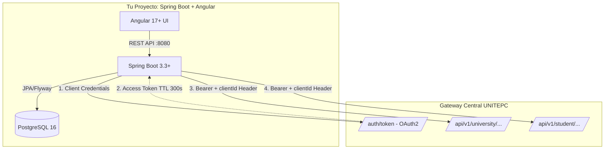

# GUÍA DE INTEGRACIÓN OFICIAL: SERVICIOS SEA & MENÚ INSTITUCIONAL (UNITEPC)
**Autor:** Ariel Camara / XpertiFlow (XF)  
**Ecosistema:** Sistema de Evaluaciones SEA / SISA  
**Stack de Destino:** Spring Boot 3.3+ (Java 21) + Angular 17+ + PostgreSQL 16  
**Fecha:** Agosto 2026  

---

## 1. 🌐 ARQUITECTURA DE INTEGRACIÓN CON EL GATEWAY SEA

El ecosistema institucional expone una API Gateway centralizada basada en **OAuth 2.0 M2M (Machine to Machine)**.



* **URL Base Gateway (Desarrollo)**: `https://gw-dev.unitepc.solutions`
* **Tipo de Autenticación**: `grant_type: client_credentials`
* **Cabeceras Obligatorias en cada petición**:
  * `Authorization: Bearer <access_token>`
  * `clientId: <system_client_id>` (por ejemplo: `sea-evaluaciones` o el identificador del nuevo subsistema).

---

## 2. 📡 CATÁLOGO COMPLETO DE ENDPOINTS DEL GATEWAY SEA

| Entidad | Método & Endpoint | Parámetros Query | Descripción |
| :--- | :--- | :--- | :--- |
| **Autenticación** | `POST /auth/token` | Form: `client_id`, `client_secret`, `grant_type=client_credentials` | Obtiene el token JWT temporal (expira en 300 segundos). |
| **Sedes** | `GET /api/v1/university/externals/research/branchOffices` | Ninguno | Lista de sedes (Cochabamba, La Paz, El Alto, Santa Cruz, etc.). |
| **Carreras** | `GET /api/v1/university/externals/research/careers` | `branchOfficeCode=CBA` | Carreras habilitadas por sede. |
| **Asignaturas (Pensum)** | `GET /api/v1/university/externals/research/courses` | `branchOfficeCode=CBA&careerCode=SIS-PLAN2023` | Materias, códigos, créditos y semestres de la carrera. |
| **Grupos y Docentes** | `GET /api/v1/student/externals/research/groups` | `term=2-2026&branchOfficeId=...&careerId=...&syllabusCourseId=...` | Grupos teóricos/prácticos (`TA-01`, `TB-01`), docente titular, aula, horario y campus. |
| **Estudiantes por Grupo** | `GET /api/v1/student/externals/research/students/byGroup` | `groupId=<id_grupo>` | Nómina oficial de alumnos inscritos (código, nombres, apellidos). |
| **Campus** | `GET /api/v1/student/externals/research/campuses` | `branchOfficeId=...` | Sedes físicas / campus (Campus Colonial, Campus Juan Pablo II, etc.). |
| **Gestión Activa** | `GET /api/v1/university/externals/research/timeFrames/active` | Ninguno | Periodo académico vigente (ej. `2-2026`). |

---

## 3. ☕ IMPLEMENTACIÓN EN BACKEND (SPRING BOOT 3.3+ / JAVA 21)

### A. Configuración en `application.yml`
```yaml
app:
  unitepc:
    gateway-base-url: https://gw-dev.unitepc.solutions
    client-id: ${UNITEPC_CLIENT_ID:tu_client_id}
    client-secret: ${UNITEPC_CLIENT_SECRET:tu_client_secret}
    system-client-id: ${UNITEPC_SYSTEM_CLIENT_ID:sea-mi-sistema}
```

### B. DTOs de Respuesta (Java 21 Records)
```java
package com.xpertiflow.evaluaciones.api.dto.gateway;

import com.fasterxml.jackson.annotation.JsonProperty;

public record TokenResponseDto(
    @JsonProperty("access_token") String accessToken,
    @JsonProperty("token_type") String tokenType,
    @JsonProperty("expires_in") Integer expiresIn
) {}

public record BranchOfficeDto(String id, String code, String name) {}

public record CareerDto(String id, String code, String name, String branchOfficeCode) {}

public record CourseDto(
    String id, 
    String code, 
    String name, 
    Integer semester, 
    String syllabusCourseId, 
    String careerCode
) {}

public record GroupItemDto(
    String id, 
    String name, 
    String classType, 
    String teacherName, 
    String teacherCi,
    String classroom, 
    String schedule, 
    String campus, 
    Integer enrolledStudentsCount
) {}

public record StudentItemDto(
    String id, 
    String code, 
    String firstName, 
    String firstLastName, 
    String secondLastName
) {}

public record CampusDto(String id, String name, String branchOfficeId) {}

public record TimeFrameDto(String id, String name, String year, String term, Boolean active) {}
```

### C. Cliente Gateway con Auto-Renovación de Token (`UnitepcGatewayClient.java`)
```java
package com.xpertiflow.evaluaciones.infrastructure.gateway;

import com.xpertiflow.evaluaciones.api.dto.gateway.*;
import lombok.extern.slf4j.Slf4j;
import org.springframework.beans.factory.annotation.Value;
import org.springframework.core.ParameterizedTypeReference;
import org.springframework.http.MediaType;
import org.springframework.stereotype.Service;
import org.springframework.util.LinkedMultiValueMap;
import org.springframework.util.MultiValueMap;
import org.springframework.web.client.RestClient;

import java.time.Instant;
import java.util.List;

@Slf4j
@Service
public class UnitepcGatewayClient {

    private final RestClient restClient;

    @Value("${app.unitepc.client-id}")
    private String clientId;

    @Value("${app.unitepc.client-secret}")
    private String clientSecret;

    @Value("${app.unitepc.system-client-id}")
    private String systemClientId;

    private String accessToken;
    private Instant tokenExpiration;

    public UnitepcGatewayClient(@Value("${app.unitepc.gateway-base-url}") String baseUrl) {
        this.restClient = RestClient.builder().baseUrl(baseUrl).build();
    }

    private synchronized String getToken() {
        if (accessToken != null && tokenExpiration != null && Instant.now().isBefore(tokenExpiration.minusSeconds(30))) {
            return accessToken;
        }

        MultiValueMap<String, String> form = new LinkedMultiValueMap<>();
        form.add("grant_type", "client_credentials");
        form.add("client_id", clientId);
        form.add("client_secret", clientSecret);

        TokenResponseDto response = restClient.post()
                .uri("/auth/token")
                .contentType(MediaType.APPLICATION_FORM_URLENCODED)
                .body(form)
                .retrieve()
                .body(TokenResponseDto.class);

        if (response == null || response.accessToken() == null) {
            throw new RuntimeException("Error autenticando con el Gateway UNITEPC");
        }

        this.accessToken = response.accessToken();
        this.tokenExpiration = Instant.now().plusSeconds(response.expiresIn() != null ? response.expiresIn() : 300);
        log.info("Token SEA renovado exitosamente. Expira en {} seg.", response.expiresIn());
        return this.accessToken;
    }

    public List<BranchOfficeDto> getBranchOffices() {
        return restClient.get()
                .uri("/api/v1/university/externals/research/branchOffices")
                .headers(h -> {
                    h.setBearerAuth(getToken());
                    h.set("clientId", systemClientId);
                })
                .retrieve()
                .body(new ParameterizedTypeReference<>() {});
    }

    public List<CareerDto> getCareers(String branchOfficeCode) {
        return restClient.get()
                .uri(uriBuilder -> uriBuilder
                        .path("/api/v1/university/externals/research/careers")
                        .queryParam("branchOfficeCode", branchOfficeCode)
                        .build())
                .headers(h -> {
                    h.setBearerAuth(getToken());
                    h.set("clientId", systemClientId);
                })
                .retrieve()
                .body(new ParameterizedTypeReference<>() {});
    }

    public List<CourseDto> getCourses(String branchOfficeCode, String careerCode) {
        return restClient.get()
                .uri(uriBuilder -> uriBuilder
                        .path("/api/v1/university/externals/research/courses")
                        .queryParam("branchOfficeCode", branchOfficeCode)
                        .queryParam("careerCode", careerCode)
                        .build())
                .headers(h -> {
                    h.setBearerAuth(getToken());
                    h.set("clientId", systemClientId);
                })
                .retrieve()
                .body(new ParameterizedTypeReference<>() {});
    }

    public List<GroupItemDto> getGroups(String term, String branchOfficeId, String careerId, String syllabusCourseId) {
        return restClient.get()
                .uri(uriBuilder -> uriBuilder
                        .path("/api/v1/student/externals/research/groups")
                        .queryParam("term", term)
                        .queryParam("branchOfficeId", branchOfficeId)
                        .queryParam("careerId", careerId)
                        .queryParam("syllabusCourseId", syllabusCourseId)
                        .build())
                .headers(h -> {
                    h.setBearerAuth(getToken());
                    h.set("clientId", systemClientId);
                })
                .retrieve()
                .body(new ParameterizedTypeReference<>() {});
    }

    public List<StudentItemDto> getStudentsByGroup(String groupId) {
        return restClient.get()
                .uri(uriBuilder -> uriBuilder
                        .path("/api/v1/student/externals/research/students/byGroup")
                        .queryParam("groupId", groupId)
                        .build())
                .headers(h -> {
                    h.setBearerAuth(getToken());
                    h.set("clientId", systemClientId);
                })
                .retrieve()
                .body(new ParameterizedTypeReference<>() {});
    }

    public TimeFrameDto getActiveTimeFrame() {
        return restClient.get()
                .uri("/api/v1/university/externals/research/timeFrames/active")
                .headers(h -> {
                    h.setBearerAuth(getToken());
                    h.set("clientId", systemClientId);
                })
                .retrieve()
                .body(TimeFrameDto.class);
    }
}
```

### D. Controlador REST para Exponer al Frontend (`CatalogoAcademicoController.java`)
```java
package com.xpertiflow.evaluaciones.api.controller;

import com.xpertiflow.evaluaciones.api.dto.gateway.*;
import com.xpertiflow.evaluaciones.infrastructure.gateway.UnitepcGatewayClient;
import lombok.RequiredArgsConstructor;
import org.springframework.http.ResponseEntity;
import org.springframework.web.bind.annotation.*;

import java.util.List;

@RestController
@RequestMapping("/api/v1/catalogo-academico")
@RequiredArgsConstructor
@CrossOrigin(origins = "*")
public class CatalogoAcademicoController {

    private final UnitepcGatewayClient gatewayClient;

    @GetMapping("/branchOffices")
    public ResponseEntity<List<BranchOfficeDto>> getBranchOffices() {
        return ResponseEntity.ok(gatewayClient.getBranchOffices());
    }

    @GetMapping("/careers")
    public ResponseEntity<List<CareerDto>> getCareers(@RequestParam String branchOfficeCode) {
        return ResponseEntity.ok(gatewayClient.getCareers(branchOfficeCode));
    }

    @GetMapping("/courses")
    public ResponseEntity<List<CourseDto>> getCourses(
            @RequestParam String branchOfficeCode, 
            @RequestParam String careerCode
    ) {
        return ResponseEntity.ok(gatewayClient.getCourses(branchOfficeCode, careerCode));
    }

    @GetMapping("/students/byGroup")
    public ResponseEntity<List<StudentItemDto>> getStudentsByGroup(@RequestParam String groupId) {
        return ResponseEntity.ok(gatewayClient.getStudentsByGroup(groupId));
    }
}
```

---

## 4. 🐘 ESQUEMA DE BASE DE DATOS (POSTGRESQL 16 / FLYWAY)

```sql
-- V1__catalogo_sea.sql
CREATE TABLE sea_sedes (
    id VARCHAR(64) PRIMARY KEY,
    codigo VARCHAR(20) NOT NULL UNIQUE,
    nombre VARCHAR(100) NOT NULL
);

CREATE TABLE sea_carreras (
    id VARCHAR(64) PRIMARY KEY,
    codigo VARCHAR(30) NOT NULL,
    nombre VARCHAR(150) NOT NULL,
    sede_codigo VARCHAR(20) REFERENCES sea_sedes(codigo)
);

CREATE TABLE sea_materias (
    id VARCHAR(64) PRIMARY KEY,
    codigo VARCHAR(30) NOT NULL,
    nombre VARCHAR(150) NOT NULL,
    semestre SMALLINT NOT NULL DEFAULT 1,
    syllabus_course_id VARCHAR(64) NULL,
    carrera_id VARCHAR(64) REFERENCES sea_carreras(id)
);

CREATE TABLE sea_grupos (
    id VARCHAR(64) PRIMARY KEY,
    codigo_grupo VARCHAR(20) NOT NULL,
    tipo_clase VARCHAR(20) NOT NULL DEFAULT 'TEORICA',
    docente_nombre VARCHAR(150) NOT NULL,
    docente_ci VARCHAR(30) NULL,
    horario VARCHAR(80) NULL,
    aula VARCHAR(50) NULL,
    campus VARCHAR(100) NULL,
    materia_id VARCHAR(64) REFERENCES sea_materias(id)
);
```

---

## 5. 🎨 IMPLEMENTACIÓN EN FRONTEND (ANGULAR 17+ / PRIMENG / TAILWIND)

### A. Paleta de Colores y Tokens Institucionales (`unitepc-pro`)
* **Púrpura Principal**: `#7B47B8` (Dark: `#5C2E94`, Soft: `#F0E9F8`)
* **Teal Secundario**: `#1F9FAD` (Dark: `#157985`, Soft: `#E0F2F4`)
* **Tipografías**: `Geist` (Textos) y `Geist Mono` (Códigos, IDs, Tokens).

### B. Servicio Angular de Conexión (`unitepc-gateway.service.ts`)
```typescript
import { Injectable, inject, signal } from '@angular/core';
import { HttpClient } from '@angular/common/http';
import { Observable, tap } from 'rxjs';

@Injectable({ providedIn: 'root' })
export class UnitepcGatewayService {
  private readonly http = inject(HttpClient);
  private readonly baseUrl = 'http://localhost:8080/api/v1/catalogo-academico';

  public readonly seaStatus = signal<'online' | 'offline' | 'sync'>('online');
  public readonly lastCheck = signal<Date>(new Date());

  getBranchOffices(): Observable<any[]> {
    return this.http.get<any[]>(`${this.baseUrl}/branchOffices`).pipe(
      tap({
        next: () => this.seaStatus.set('online'),
        error: () => this.seaStatus.set('offline')
      })
    );
  }

  getCareers(branchOfficeCode: string): Observable<any[]> {
    return this.http.get<any[]>(`${this.baseUrl}/careers`, { params: { branchOfficeCode } });
  }

  getCourses(branchOfficeCode: string, careerCode: string): Observable<any[]> {
    return this.http.get<any[]>(`${this.baseUrl}/courses`, { params: { branchOfficeCode, careerCode } });
  }

  getStudentsByGroup(groupId: string): Observable<any[]> {
    return this.http.get<any[]>(`${this.baseUrl}/students/byGroup`, { params: { groupId } });
  }
}
```

### C. Componente de Menú / Sidebar con Insignia Live (`sidebar.component.ts`)
```typescript
import { Component, inject } from '@angular/core';
import { CommonModule } from '@angular/common';
import { RouterModule } from '@angular/router';
import { UnitepcGatewayService } from './unitepc-gateway.service';

@Component({
  selector: 'sea-sidebar',
  standalone: true,
  imports: [CommonModule, RouterModule],
  template: `
    <aside class="w-64 bg-card border-r border-border h-screen p-4 flex flex-col justify-between">
      <div class="space-y-6">
        
        <!-- Identidad Institucional UNITEPC -->
        <div class="flex items-center gap-3 px-2">
          <div class="h-10 w-10 rounded-xl bg-purple-700 text-white flex items-center justify-center font-black text-lg shadow-md">
            U
          </div>
          <div>
            <h1 class="text-sm font-black text-foreground leading-none">UNITEPC · SEA</h1>
            <span class="text-[10px] font-bold text-purple-600">Portal de Servicios</span>
          </div>
        </div>

        <!-- Módulos de Navegación -->
        <div class="space-y-1">
          <span class="text-[10px] font-extrabold uppercase text-muted-foreground tracking-wider px-3 block mb-2">
            Módulos del Sistema
          </span>

          <a routerLink="/dashboard" routerLinkActive="bg-purple-50 text-purple-700 font-bold border-purple-300"
             class="flex items-center gap-3 px-3.5 py-2.5 rounded-xl text-sm font-medium text-muted-foreground hover:bg-muted border border-transparent transition-all">
            <i class="pi pi-chart-pie"></i>
            <span>Dashboard</span>
          </a>

          <!-- Módulo Servicios SEA con Indicador Live / Offline -->
          <a routerLink="/catalogo-academico" routerLinkActive="bg-purple-50 text-purple-700 font-bold border-purple-300"
             class="flex items-center justify-between px-3.5 py-2.5 rounded-xl text-sm font-medium text-muted-foreground hover:bg-muted border border-transparent transition-all">
            <div class="flex items-center gap-3">
              <i class="pi pi-building-columns"></i>
              <span>Servicios SEA</span>
            </div>
            
            @if (gateway.seaStatus() === 'online') {
              <span class="bg-emerald-100 text-emerald-800 text-[10px] font-black px-1.5 py-0.5 rounded-md flex items-center gap-1">
                <i class="pi pi-circle-fill text-[6px] text-emerald-600"></i> Live
              </span>
            } @else {
              <span class="bg-rose-100 text-rose-800 text-[10px] font-black px-1.5 py-0.5 rounded-md flex items-center gap-1 animate-pulse">
                <i class="pi pi-circle-fill text-[6px] text-rose-600"></i> Offline
              </span>
            }
          </a>

          <a routerLink="/plan-estudios" routerLinkActive="bg-purple-50 text-purple-700 font-bold border-purple-300"
             class="flex items-center gap-3 px-3.5 py-2.5 rounded-xl text-sm font-medium text-muted-foreground hover:bg-muted border border-transparent transition-all">
            <i class="pi pi-book"></i>
            <span>Plan de Estudios</span>
          </a>
        </div>
      </div>

      <!-- Pie de Usuario -->
      <div class="border-t border-border pt-3 px-2 flex items-center gap-3">
        <div class="h-8 w-8 rounded-full bg-purple-100 text-purple-700 font-black flex items-center justify-center text-xs">
          AD
        </div>
        <div class="min-w-0 flex-1">
          <p class="text-xs font-bold text-foreground truncate">Administrador</p>
          <p class="text-[10px] text-muted-foreground truncate">Sede Cochabamba</p>
        </div>
      </div>
    </aside>
  `
})
export class SidebarComponent {
  public readonly gateway = inject(UnitepcGatewayService);
}
```

---

## 6. 🚀 CHECKLIST DE PUESTA EN MARCHA

1. **Variables de Entorno**:
   * `UNITEPC_GATEWAY_BASE_URL=https://gw-dev.unitepc.solutions`
   * `UNITEPC_CLIENT_ID=<tu_client_id>`
   * `UNITEPC_CLIENT_SECRET=<tu_client_secret>`
   * `UNITEPC_SYSTEM_CLIENT_ID=sea-mi-sistema`
2. **Backend**:
   * Copiar `UnitepcGatewayClient.java`, los DTOs y `CatalogoAcademicoController.java`.
3. **Frontend**:
   * Copiar `unitepc-gateway.service.ts` y la plantilla de `SidebarComponent`.
4. **Verificación**:
   * Iniciar Spring Boot y Angular; el indicador mostrará **`Live`** y listará las sedes y carreras sincronizadas en tiempo real con el servidor central de UNITEPC.
